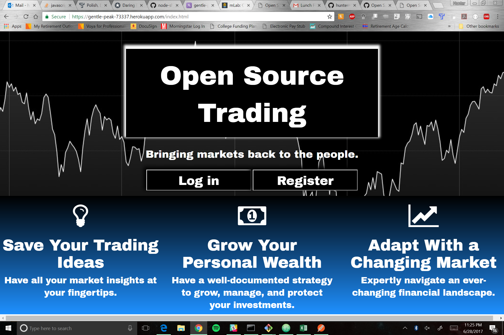

# Open Source Trading: Bringing Markets Back to the People

> This is a project that allows users to create securities trading ideas and interact with other traders to open source knowledge. You can create and delete your own ideas and explore what others have to say. More functionality coming soon!
>

> The code utilized here is HTML, CSS (with Bootstrap), JavaScript, and jQuery on the front end. On the back end I'm using Node.js and Express. I've created an API that allows users to create and delete their own ideas, get and display ideas, log in and log out to have their ideas saved. Direct any inquiries to huntermotte@gmail.com.
>
